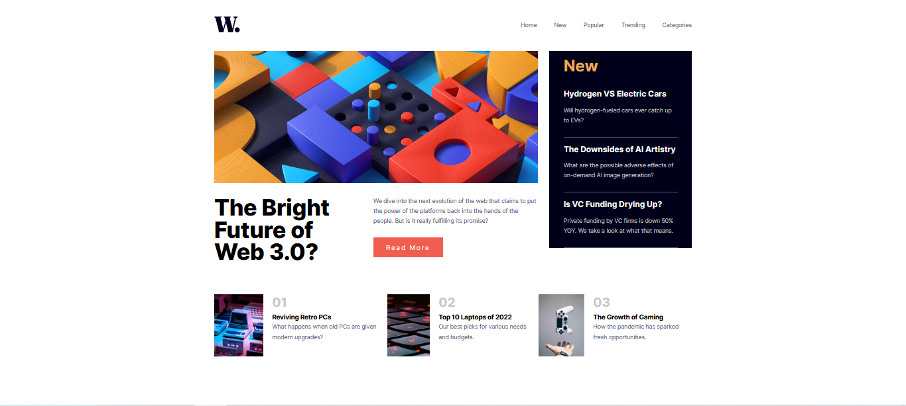

# Frontend Mentor - News homepage solution

This is a solution to the [News homepage challenge on Frontend Mentor](https://www.frontendmentor.io/challenges/news-homepage-H6SWTa1MFl). Frontend Mentor challenges help you improve your coding skills by building realistic projects. 

## Table of contents

- [Overview](#overview)
  - [The challenge](#the-challenge)
  - [Screenshot](#screenshot)
  - [Links](#links)
- [My process](#my-process)
  - [Built with](#built-with)
  - [What I learned](#what-i-learned)
  - [Useful resources](#useful-resources)
- [Author](#author)
- [Acknowledgments](#acknowledgments)

## Overview

### The challenge

Users should be able to:

- View the optimal layout for the interface depending on their device's screen size
- See hover and focus states for all interactive elements on the page

### Screenshot

### Links

- Solution URL: [Solution](https://your-solution-url.com)
- Live Site URL: [Site](https://your-live-site-url.com)

## My process

### Built with

- Semantic HTML5 markup
- CSS custom properties
- Flexbox
- Mobile-first workflow
- Parcel
- Sass

### What I learned

The most challenging part of this project was making the hamburger menu for the mobile version but after doing some research and some trial and error I managed to make a good looking menu with some smooth transitions.

### Useful resources

- [Multiple hamburger menu pen](https://codepen.io/alvarotrigo/pen/RwLGjKq) - This pen helped me a lot to get an idea of how to make the hamburger menu. Big thaks to [Álvaro](https://codepen.io/alvarotrigo) for making it.

## Author

- Github - [Juan Martín Rivas](https://github.com/JuanMartinRivas)
- Frontend Mentor - [@JuanMartinRivas](https://www.frontendmentor.io/profile/JuanMartinRivas)
- Twitter - [@RivasJuanman](https://twitter.com/RivasJuanman)
- Linkedin - [Juan Martín Rivas](https://www.linkedin.com/in/juan-mart%C3%ADn-rivas-b3253a1a8/?locale=en_US)

## Acknowledgments

A big thank you to anyone providing feedback on my [solution](https://your-solution-url.com). It definitely helps to find new ways to code and find easier solutions!
